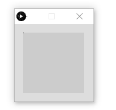
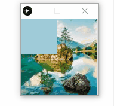
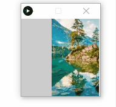
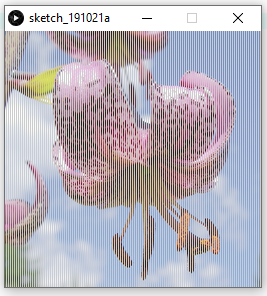
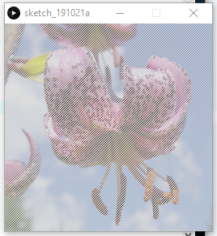
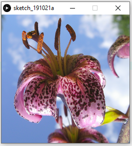
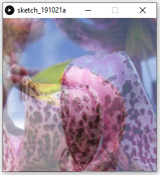
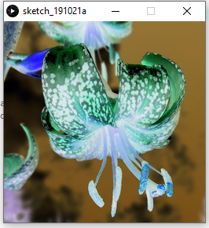
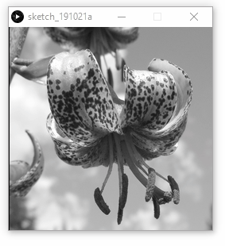

# pixels[]

El procesamiento de imágenes es un término muy amplio y general para referirse a la manipulación y
modificación de las mismas, o en su defecto, producir un resultado estético o mejorar la comunicación.
Programas como GIMP o Adobe Photoshop provee al usuario de herramientas para manipular imágenes,
incluyendo cambios de contraste o desenfoque.
En Processing, cada imagen es almacenada como un array de una dimensión de colores. Cuando imagen
es mostrada en pantalla, cada elemento del array es dibujado como un píxel. Por lo tanto, al multiplicar el
ancho por el alto de la imagen se puede determinar el número de píxeles empleados. Si una imagen es de
100 píxeles de ancho por 100 píxeles de alto, el array contendrá 10000 elementos. Sí una imagen es de 200
píxeles de ancho por 2 píxeles de alto, el array tendrá 400 elementos. La primera posición del array es el
primer píxel de la esquina superior izquierda, y la última es el último píxel de la esquina inferior derecha.

### Píxeles
El array pixels[] almacena el valor de color de cada píxel. La función loadPixels() debe ser llamada
antes de pixels[]. Luego de que los píxeles son leídos o modificados, ellos deben actualizarse mediante la
función updatePixels(). Como beginShape() y endShape(), loadPixels() y updatePixels(),
siempre están juntas.  

``` Processing
void setup() {
  size(100, 100);
}
void draw() {
  float gray = map(second(), 0, 59, 0, 255);
  color c = color(gray);
  int index = frameCount % (width*height);
  loadPixels();
  pixels[index] = c;
  updatePixels();
}
```


Las funciones loadPixels() y updatePixels() aseguran que el array pixels[] esté listo para ser
modificado y actualizado. Hay que asegurarse, además, que esté declarado en torno a cualquier bloque, y
solo utilizarlo cuando sea necesario, puesto su sobreutilización puede entorpecer el programa y hacerlo lento.
Leer y escribir datos directamente con pixels[] es un método distinto que hacerlo con las funciones de
get() y set(). La coordenada-x y la coordenada-y pueden ser mapeadas a una posición correspondiente
del array, por multiplicar el valor de y por el ancho de la ventana de representación, y sumarle a este el valor
de x. Para calcular, entonces, cualquier posición de píxeles en el array, debe utilizarse la siguiente ecuación:
(y*width)+x

```Processing
//Estas tres líneas de código equivalen a: set(25, 50, color(0))
loadPixels();
pixels[50*width + 25] = color(0);
updatePixels();
```

Para convertir los valores en la dirección opuesta, debe dividirse la posición de los píxeles en el array por el
ancho de la ventana de representación, para obtener la coordenada-y, y obtener el módulo de la posición y el
ancho de la ventana de representación, para obtener la coordenada-x.

```Processing
//Estas tres líneas de código equivalen a: pixels[5075] = color(0)
int y = 5075 / width;
int x = 5075 % width;
set(x, y, color(0));
```

En programas que requieren manipular una gran cantidad de píxeles, la implementación de pixels[] es
mucho más rápida que la de get() y set(). Los siguientes ejemplos han sido mostrados al explicarse
get() y set() en unidades anteriores. No obstante, aquí se implementan con pixels[] para demostrar la
velocidad con la que opera el programa.

```Processing
void setup() {
  size(100, 100);
}
void draw() {
  //Contrae para no exceder el límite del array
  int mx = constrain(mouseX, 0, 99);
  int my = constrain(mouseY, 0, 99);
  loadPixels();
  pixels[my*width + mx] = color(0);
  updatePixels();
}
```


```Processing
PImage arch;
void setup() {
  size(100, 100);
  noStroke();
  arch = loadImage("landscape.jpg");
}
void draw() {
  background(arch);
  //Contrae para no exceder el límite del array
  int mx = constrain(mouseX, 0, 99);
  int my = constrain(mouseY, 0, 99);
  loadPixels();
  color c = pixels[my*width + mx];
  fill(c);
  rect(20, 20, 60, 60);
}
```


Cada imagen tiene su propio array pixels[], al cual se puede acceder con el operador punto. Esto hace posible
mostrar una imagen mientras se modifican los píxeles en otra imagen.

```Processing
PImage arch;
void setup() {
  size(100, 100);
  arch = loadImage("landscape.jpg");
}
void draw() {
  background(204);
  int mx = constrain(mouseX, 0, 99);
  int my = constrain(mouseY, 0, 99);
  arch.loadPixels();
  arch.pixels[my*width + mx] = color(0);
  arch.updatePixels();
  image(arch, 50, 0);
}
```


Al implementar el array pixels[], en lugar de la función image() para mostrar una imagen en pantalla,
este array provee de más control de la mencionada imagen. Simples operaciones matemáticas o pequeños
cálculos, sumado a un ciclo FOR, revela el verdadero potencial de pixels[] como array.
```Processing
PImage flor = loadImage("flor.jpg");
size(256, 256);
int count = flor.width * flor.height;
flor.loadPixels();
loadPixels();
for (int i = 0; i < count; i += 2) {
  pixels[i] = flor.pixels[i];
}
updatePixels();
```

```Processing
PImage flor = loadImage("flor.jpg");
size(256, 256);
int count = flor.width * flor.height;
flor.loadPixels();
loadPixels();
for (int i = 0; i < count; i += 3) {
  pixels[i] = flor.pixels[i];
}
updatePixels();
```


```Processing
PImage flor = loadImage("flor.jpg");
size(256, 256);
int count = flor.width * flor.height;
flor.loadPixels();
loadPixels();
for (int i = 0; i < count; i++) {
  pixels[i] = flor.pixels[count - i - 1];
}
updatePixels();
```


```Processing
PImage flor = loadImage("flor.jpg");
size(256, 256);
int count = flor.width * flor.height;
flor.loadPixels();
loadPixels();
  for (int i = 0; i < count; i++) {
pixels[i] = flor.pixels[i/2];
}
updatePixels();
```



### Componentes del Píxel
Las funciones red(), green() y blue() son utilizadas para leer valores individuales de los píxeles. Estos
valores pueden ser modificados y devueltos al array píxels[]. En el siguiente ejemplo, se muestra como
invertir los valores de color de una imagen.

```Processing
PImage arch = loadImage("puerto.jpg");
background(arch);
loadPixels();
for (int i = 0; i < width*height; i++) {
  color p = pixels[i]; //Conseguir píxeles
  float r = 255 - red(p); //Modificar valor rojo
  float g = 255 - green(p); //Modificar valor de verde
  float b = 255 - blue(p); //Modificar valor de azul
  pixels[i] = color(r, g, b); //Asignar valor modificado
}
updatePixels();
```


Los valores del teclado y el mouse pueden ser utilizados en la manera en la que el array pixels[] modifica
mientras el programa se está ejecutando. En el siguiente ejemplo, una imagen es convertida a escala de
grises al incrementar sus componentes. Estos valores son incrementados con mouseX, haciendo la imagen
mas luminosa.
```Processing
PImage arch;
void setup() {
  size(100, 100);
  arch = loadImage("puerto.jpg");
}
void draw() {
  background(arch);
  loadPixels();
  for (int i = 0; i < width*height; i++) {
    color p = pixels[i]; //Leer color de la pantalla
    float r = red(p); //Modificar valor de rojo
    float g = green(p); //Modificar valor de verde
    float b = blue(p); //Modificar valor de azul
    float bw = (r + g + b) / 3.0;
    bw = constrain(bw + mouseX, 0, 255);
    pixels[i] = color(bw); //Asignar valor modificado
  }
  updatePixels();
  line(mouseX, 0, mouseX, height);
}
```
  

Estas funciones de modificación individual son muy útiles, pero también muy lentas. Cuando se requiere que
se modifique de forma individual cientos o miles de veces mientras se ejecuta el programa, se recomienda
utilizar una técnica conocida como bit-shifting.
